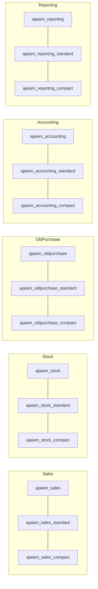
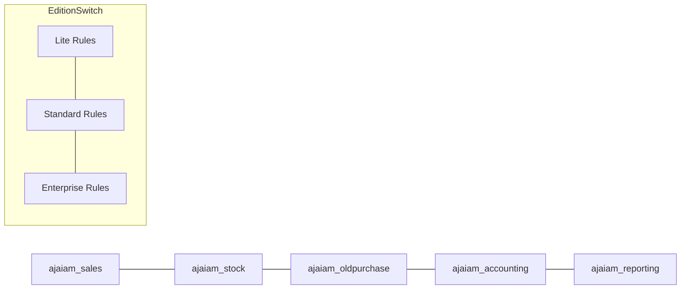
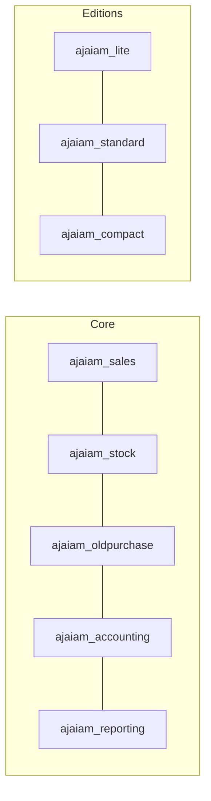
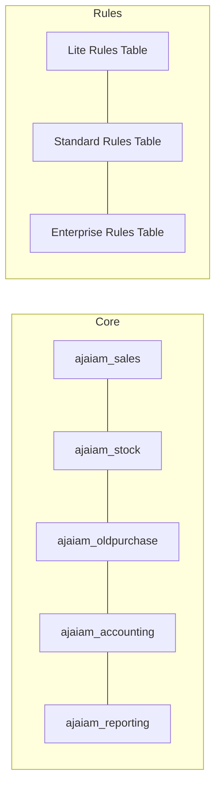

# Odoo Jewellery ERP – Architecture Options for Compact / Lite / Standard Editions

This document outlines **four alternative approaches** to structure our Odoo 18 CE custom development for the jewellery ERP application (AJAIAM). Each option addresses how to support multiple product editions: **Lite, Standard, Enterprise**.

---

## 📊 Option 1 – Sub-Modules per Edition
**Description:** Each core area (sales, stock, old purchase, accounting, reporting, etc.) has three variants: base, standard, compact.

**Mermaid Structure:**

**Pros:**
- Very explicit separation.
- Each edition fully isolated.
- Easy to deploy just one flavor.

**Cons:**
- Code duplication across editions.
- High maintenance overhead.
- Adding new features requires touching 3× modules.
- Does not scale well.

---

## ⚙️ Option 2 – Single Module + Edition Switch
**Description:** One module per domain (sales, stock, etc.). Features are controlled inside the code by edition flags (Lite/Standard/Enterprise).

**Mermaid Structure:**

**Pros:**
- Minimal number of modules.
- Easier to maintain shared logic.
- Single place for bug fixes.

**Cons:**
- Code complexity (many `if edition ==` checks).
- Hard to read/understand.
- Risk of regressions when changing edition logic.

---

## 🔀 Option 3 – Hybrid (Base + Edition Packs) ✅ Recommended
**Description:** Core modules (sales, stock, accounting, etc.) hold common features. Separate overlay modules for Lite, Standard, Enterprise extend/override behavior.

**Mermaid Structure:**

**Pros:**
- Clean separation between base logic and edition-specific logic.
- No duplication of core models.
- Easier to maintain and extend.
- Each edition overlay can selectively enable/disable features.

**Cons:**
- Slightly more complex dependency management.
- Requires careful design of inheritance (which module overrides what).

---

## 🧩 Option 4 – Configurable Rules Engine
**Description:** Core modules remain edition-agnostic. An edition rules engine (config table or ABAC logic) defines what features are enabled per edition.

**Mermaid Structure:**

**Pros:**
- Maximum flexibility.
- New editions can be added just by configuration.
- Least code duplication.

**Cons:**
- Higher upfront design complexity.
- Requires building a generic rules engine.
- Developers must understand both core logic and rules layer.

---

# 📌 Recommendation
We recommend **Option 3 – Hybrid (Base + Edition Packs)**:
- Keeps the code modular and clean.
- Avoids massive duplication (Option 1).
- Easier to maintain than scattered edition checks (Option 2).
- Simpler than designing a full rules engine (Option 4).

This approach ensures scalability and clarity for our long-term jewellery ERP roadmap.

